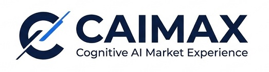
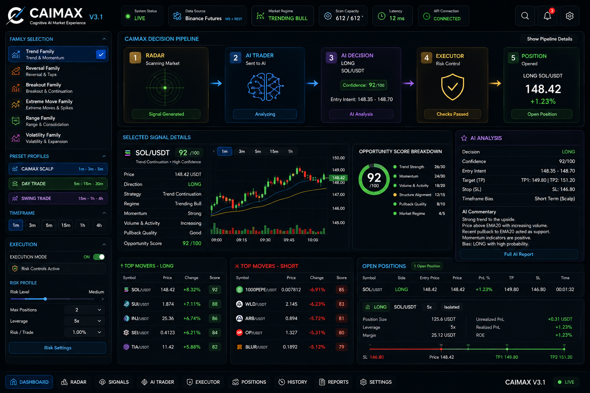
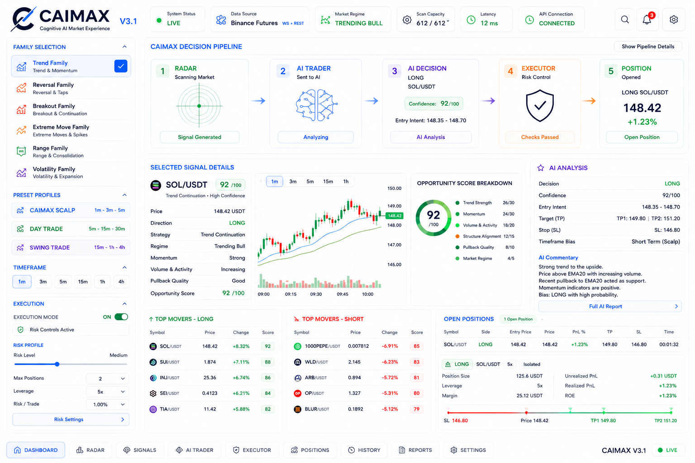
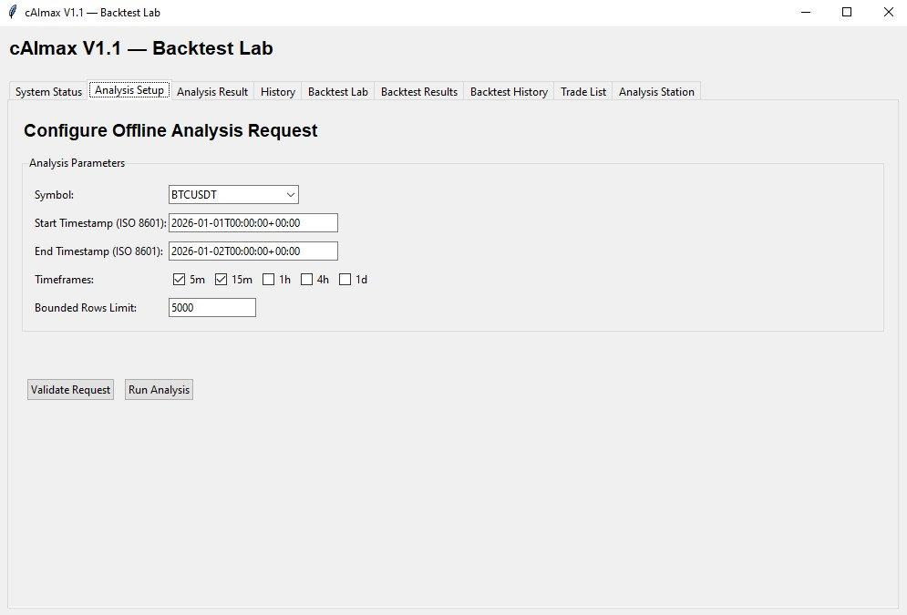

# CAIMAX

### Cognitive AI Market Experience

**Real-time market sensing, AI-assisted decision intelligence and controlled execution — in one evolving platform.**

---

## CAIMAX V3.1 — Windows Desktop

> **Product UI design entering implementation.**  
> The screenshots below show the current V3.1 desktop product direction. They are interface designs, not a claim that every visible capability is already production-complete.

### Dark Interface

### Light Interface

### Current Product Status

**V3.0 — COMPLETED** ✅  
**V3.1 — WINDOWS DESKTOP — IN DEVELOPMENT** 🚧  
**NEXT — V4 MARKET MEMORY** ◌

CAIMAX V3.1 is designed to bring market scanning, opportunity scoring, AI analysis, execution controls and position monitoring into one clear desktop experience.

---

# What is CAIMAX?

CAIMAX — **Cognitive AI Market Experience** — is an evolving market intelligence platform designed to observe markets from multiple analytical perspectives, identify high-quality opportunities, send structured evidence to an AI decision layer, and optionally convert approved decisions into controlled execution.

CAIMAX is **not built around one indicator, one strategy or one AI provider**.

The core idea is simple:

> **Find the opportunity. Build the evidence. Interpret the context. Execute only when justified.**

Instead of asking one model to continuously watch an entire market, CAIMAX separates the problem into specialized layers.

---

# How CAIMAX Works

## 1 — CAIMAX Radar

The Radar continuously observes market data and searches for candidates worth deeper analysis.

Its role is not to blindly generate trades. It is a selective first intelligence layer that can:

- scan large market universes,
- process fast live market data,
- evaluate multiple analysis families,
- score opportunity quality,
- preserve sensor and candle context,
- reject weak or late candidates,
- forward only sufficiently strong opportunities to the next layer.

**The Radar is useful even without AI or automated execution.**

---

## 2 — AI Trader / CAIMAX Intelligence

A selected opportunity is enriched with structured context before reaching the decision layer.

That context can include:

- family-level scores,
- individual sensor contributions,
- trend and momentum structure,
- volume and volatility context,
- liquidity and order-flow information,
- derivatives positioning,
- numerical candle geometry,
- multi-timeframe context,
- risk and invalidation information,
- and, beginning with the V4 direction, historical evidence from similar market episodes.

Today this layer can use external or local AI/ML models. The architecture is intended to remain **model- and provider-agnostic**.

The longer-term goal is for CAIMAX to increasingly occupy this decision layer itself through specialized ML models, market-state intelligence, ensembles and AI reasoning.

> **CAIMAX finds. Intelligence evaluates.**

---

## 3 — Controlled Execution

When a decision is approved, the execution layer translates it into a controlled market action.

The execution layer can be responsible for:

- position sizing,
- leverage limits,
- maximum simultaneous positions,
- TP / SL rules,
- time-based exits,
- exchange constraints,
- position lifecycle tracking,
- execution errors and safety checks,
- and feeding the result back into CAIMAX research and memory.

The key principle is separation:

> **Intelligence can recommend. Execution remains deterministic and risk-controlled.**

---

# One Platform, Three Ways to Use It

CAIMAX is designed to be useful at different levels of automation.

### Radar Only

**Market → CAIMAX Radar → User**

Use CAIMAX as a selective real-time opportunity scanner and market intelligence terminal.

### Radar + AI

**Market → CAIMAX Radar → AI Analysis → User**

CAIMAX finds the candidate; AI interprets the structured evidence package.

### Full Autonomous Workflow

**Market → CAIMAX Radar → AI / CAIMAX Intelligence → Executor → Exchange**

The system can evolve into a full pipeline in which opportunities are found, evaluated, risk-checked and executed without requiring continuous manual intervention.

Execution is optional — not mandatory.

---

# Analysis Families

CAIMAX does not treat individual indicators as the architecture itself.

For example:

- EMA is a sensor inside the **Trend & Moving Average Family**.
- RSI is a sensor inside the **Momentum Family**.
- ATR belongs to the **Volatility Family**.
- Open Interest belongs to the **Derivatives & Positioning Family**.
- Order Book Imbalance belongs to the **Liquidity & Order Flow Family**.

Each family represents a different way of looking at the same market event.

### Trend & Moving Average
Direction, trend quality, moving-average structure, slope, spacing and trend persistence.

### Momentum
Speed, acceleration, continuation, exhaustion and momentum divergence.

### Volume & Participation
Whether real market participation supports the price move.

### Volatility
Expansion, contraction, abnormal range and available movement potential.

### Market Structure & Price Action
Swing structure, support/resistance, breakouts, retests, patterns and candle geometry.

### Liquidity & Order Flow
Bid/ask pressure, order-book imbalance, delta, depth, liquidity gaps and aggressive flow.

### Derivatives & Positioning
Open Interest, funding, liquidation pressure and futures-market positioning.

### Market Context & Regime
Whether the market is trending, ranging, volatile, quiet, risk-on or risk-off — and how the broader market affects the current instrument.

CAIMAX can expand with additional families and sensors as research evidence justifies them.

The goal is not to collect indicators for their own sake. The goal is to understand **which type of evidence matters in which type of market state**.

---

# Opportunity Scoring

Instead of asking a single indicator for a yes/no answer, CAIMAX can combine evidence from multiple independent perspectives.

A future scoring packet may look conceptually like this:

- Trend & Moving Average: **88 / 100**
- Momentum: **81 / 100**
- Volume & Participation: **76 / 100**
- Liquidity & Order Flow: **72 / 100**
- Volatility: **84 / 100**
- Historical Evidence: **79 / 100**
- Final Opportunity Score: **82 / 100**

The score alone is not enough.

CAIMAX should also preserve **why** the score exists — which families contributed, which sensors disagreed, what the market regime was, and what invalidates the opportunity.

---

# V4 — Market Memory

**Next major direction: give CAIMAX memory.**

The goal of Market Memory is to connect a live opportunity with historically similar market episodes.

For example:

> A similar market structure appeared 30 times during the last five months.

CAIMAX should be able to ask:

- How often did the move continue?
- How often did it reverse?
- What was the typical MFE / MAE?
- How long did the episode last?
- Which analysis family recognized the behavior most effectively?
- Which family combinations were useful?
- Under what conditions did the pattern fail?

This creates a second evidence dimension:

**Live Evidence + Historical Evidence + Family Reliability + Market Context**

The same family does not need to carry the same importance in every market regime.

---

# Built for End Users

CAIMAX is intended to evolve beyond terminals and research scripts into an easy-to-use cross-platform product.

### Product Vision

**Windows · macOS · Android · iOS**

The user-facing interface is intended to make advanced market intelligence accessible without requiring terminal knowledge.

Users should eventually be able to control from the interface:

- active analysis families,
- individual sensors where appropriate,
- timeframe,
- Scalp / Day Trade / Swing profiles,
- custom profiles,
- Opportunity Score and evidence,
- AI analysis,
- execution on/off,
- risk controls,
- open positions,
- history and reports.

> **Complex intelligence behind a clear interface.**

---

# CAIMAX Product Profiles

Users should not need to configure every sensor manually.

### CAIMAX Scalp
Short timeframes, faster momentum/trend assessment, liquidity, order flow and fast invalidation.

### Day Trade
Broader multi-timeframe context combining trend, momentum, volume, volatility, structure and derivatives information.

### Swing Trade
Higher-timeframe structure, regime, positioning, relative levels and broader market context.

### Custom
Advanced users can choose their own family and sensor combinations.

CAIMAX is intended to be a configurable market intelligence station — not a closed system built around one universal strategy.

---

# From Research Engine to Cognitive Market Intelligence

CAIMAX has evolved through multiple research and product stages.

## V1.x — Foundations

**Where CAIMAX learned how to analyze.**

Early versions established core ideas that later became part of the broader architecture, including:

- trade performance analytics,
- comparison and explainability,
- replay infrastructure,
- multi-timeframe synchronization,
- lookahead-safety principles,
- and Strategy Family architecture.

> V1 transformed early market-analysis experiments into a more structured and reproducible research architecture.

Historical V1.x interface screenshots will be added here as part of the project evolution record.

---

## V2.x — Research & Backtesting Foundation

**Where CAIMAX learned how to test evidence.**

V2 expanded the platform into a deeper historical research and backtesting environment with capabilities including:

- historical data ingestion,
- replay pipelines,
- data-quality controls,
- event-driven backtesting,
- fee and slippage simulation,
- scenario grids,
- multi-timeframe robustness,
- trade audit,
- evidence chains,
- comparison and reporting.

### V2.0 Closure

**Status: COMPLETED** ✅

At the V2.0 closure milestone, the project reported **2,158 tests, 2,125 passed, 33 documented environment-related skips and 0 failures** across the full project test suite.

---

## V3.0 — Product Integration

**Where CAIMAX became one coherent working product direction.**

V3.0 focused on turning the strongest existing research and analysis capabilities into a coherent, demonstrable CAIMAX product architecture.

**Status: COMPLETED** ✅

### V3.0 Working Product View

> **This is a working CAIMAX product view from the V3.0 product line.**  
> Some visible interface labels originate from earlier UI lineage and may not reflect the latest version number shown elsewhere in the project. The screenshot is included as evidence of the product’s real evolution from the earlier Analysis Station into the V3.1 desktop direction.

The V3.0 product line represents the bridge between CAIMAX’s research/backtesting foundations and the new user-facing desktop experience.

---

## V3.1 — Windows Desktop

**Where CAIMAX becomes visible.**

The V3.1 direction brings the CAIMAX decision pipeline, family selection, opportunity scoring, AI analysis, execution controls and position monitoring into a unified Windows desktop interface.

**Status: IN DEVELOPMENT** 🚧

---

# Roadmap

The roadmap is directional. Version numbers organize the intended evolution of the platform; research evidence, architecture and user feedback may change specific implementation details.

### V3.1 — Windows Desktop
**Make CAIMAX visible.**

### V4 — Market Memory
**Give CAIMAX memory.**

Historical archive, similar-episode matching, historical evidence and family reliability.

### V5 — Research Intelligence / AI Research Director
**Teach CAIMAX how to research.**

Hypothesis generation, controlled experiments, discovery vs. confirmation and research-memory-driven next-experiment selection.

### V6 — CAIMAX Intelligence / Market State & Market Clock
**Give CAIMAX its own decision intelligence.**

The long-term decision architecture begins shifting toward:

**CAIMAX Radar → CAIMAX Intelligence → CAIMAX Execution**

with specialist models, market-state intelligence, micro + meso + macro context, timing states and model ensembles.

### V7 — Strategy Composition Engine
**Learn which specialists to trust in which market state.**

### V8 — Live / Near-Live Market Intelligence
**Continuously reason over the live market.**

### V9 — Execution Intelligence
**Understand whether an edge is realistically executable.**

Latency, spread, fees, slippage, fill feasibility and execution quality become part of the intelligence system.

### V10 — Cognitive Market Intelligence Platform
**Bring the complete system together.**

Market Memory + Research Intelligence + Market State + Strategy Composition + Live Intelligence + Execution Intelligence + Explainability + Uncertainty.

---

# The Long-Term Direction

> **V3 — CAIMAX sees and acts.**  
> **V4 — CAIMAX remembers.**  
> **V5 — CAIMAX learns how to research.**  
> **V6 — CAIMAX develops its own decision intelligence.**  
> **V7 — CAIMAX coordinates its specialists.**  
> **V8 — CAIMAX continuously reasons over live markets.**  
> **V9 — CAIMAX understands execution quality.**  
> **V10 — CAIMAX brings these capabilities together as a Cognitive Market Intelligence Platform.**

**Better Sensing → Better Understanding → Better Execution**

---

# Vision

To build a market intelligence platform that can observe markets from multiple independent perspectives, preserve historical evidence, understand uncertainty, learn which analytical views matter under different conditions, and translate justified decisions into controlled action.

# Mission

To develop CAIMAX through evidence-first research, reproducible experimentation, transparent architecture and increasingly accessible user interfaces — while keeping research, decision intelligence and execution clearly separated and independently testable.

---

# Research Principles

- **ONE MARKET PATH, MANY COMPETING HYPOTHESES**
- **FAST DISCOVER, SLOW BELIEVE**
- **DISCOVERY ≠ CONFIRMATION**
- **NO OUTCOME LEAKAGE**
- **EPISODE-AWARE SAMPLING**
- **MICRO + MESO + MACRO**
- **NO-TRADE IS A VALID RESULT**
- **FAILED EXPERIMENTS MUST NOT BE SILENTLY REPEATED**

A failed hypothesis is still useful evidence if it prevents the same mistake from being repeated.

---

# Status Legend

**COMPLETED** — milestone has been formally closed.  
**IN DEVELOPMENT** — actively being designed or implemented.  
**EXPERIMENTAL** — under research and not a production claim.  
**PLANNED** — part of the directional roadmap, not yet implemented.

---

## CAIMAX
### Cognitive AI Market Experience

**See. Remember. Understand. Decide. Execute. Learn.**

